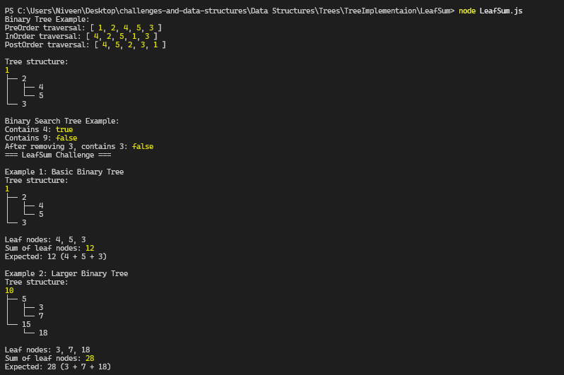
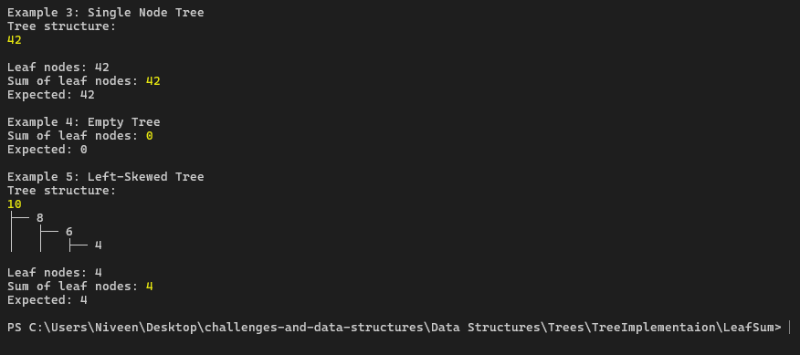

# LeafSum Challenge

## 🔺Problem Domain
Using the binary tree implementation, find the sum of all the leaf nodes.

## 📝Challenge Description
Implement a method `LeafSum()` to calculate the sum of all leaf nodes in the binary tree.

- A leaf node is a node that does not have any children (both left and right are null)
- Traverse the tree to find all the leaf nodes and sum their values
- Handle all exceptions that could be thrown during execution

## 🟩Approach & Efficiency

### Approach
The solution uses a **recursive depth-first traversal** approach:

1. **Base Case**: If the node is null, return 0
2. **Leaf Check**: If the current node has no children (both left and right are null), return the node's value
3. **Recursive Case**: Otherwise, recursively calculate the sum of leaf nodes in both left and right subtrees and return their sum

### ⏲️Time Complexity
**O(n)** - where n is the number of nodes in the tree. We visit each node exactly once.

### 🌌Space Complexity
**O(h)** - where h is the height of the tree. This represents the maximum recursion stack depth:
- Best case (balanced tree): O(log n)
- Worst case (skewed tree): O(n)

## 🧪Testing:

All exceptions are handled within the function using try-catch blocks.