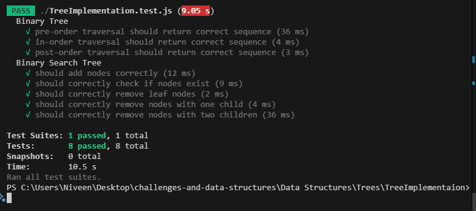

# Binary Tree and Binary Search Tree Implementation


## Problem Domain
Implement binary tree and binary search tree data structures with their core operations.

### Binary Tree
- Implement a binary tree with traversal methods (pre-order, in-order, post-order)
- Implement a method to display the tree structure visually

### Binary Search Tree
- Implement a binary search tree with standard operations (add, contains, remove)
- Maintain BST properties throughout all operations

## Inputs and Expected Outputs

### Binary Tree
- **Input:** Tree nodes with values and connections
- **Output:** Various traversal orders of the tree
```
Input Tree:
     1
   /   \
  2     3
 / \
4   5

Outputs:
- PreOrder: [1, 2, 4, 5, 3]
- InOrder: [4, 2, 5, 1, 3]
- PostOrder: [4, 5, 2, 3, 1]
```

### Binary Search Tree
- **Input:** Values to add, remove, or search
- **Output:** Modified tree structure or boolean for search
```
Input: Add nodes 5, 3, 7, 2, 4
Output Tree:
     5
   /   \
  3     7
 / \
2   4

Input: contains(4)
Output: true

Input: remove(3)
Output Tree:
     5
   /   \
  4     7
 /
2
```

## Edge Cases
1. Empty tree operations
2. Single node tree operations
3. Removing root node
4. Removing nodes with:
   - No children
   - One child
   - Two children
5. Duplicate values in BST
6. Balancing not required (tree may become unbalanced)

## Algorithm

### Binary Tree
1. Create Node class with value and left/right pointers
2. Implement traversal methods using recursion:
   - PreOrder: Process root, traverse left, traverse right
   - InOrder: Traverse left, process root, traverse right
   - PostOrder: Traverse left, traverse right, process root
3. Implement print method for visual representation

### Binary Search Tree
1. Add method:
   - Start at root
   - If value < current node, go left
   - If value >= current node, go right
   - Repeat until finding null position
   - Insert new node

2. Contains method:
   - Start at root
   - If value equals current node, return true
   - If value < current node, go left
   - If value > current node, go right
   - If reach null, return false

3. Remove method:
   - Find node to remove
   - If leaf node, simply remove
   - If one child, replace with child
   - If two children:
     - Find successor (minimum value in right subtree)
     - Copy successor value to current node
     - Remove successor

## Real Code
Implementation details can be found in:
- `TreeImplementation.js`: Contains the main implementation
- `TreeImplementation.test.js`: Contains the test cases

## Big O Time/Space Complexity

### Binary Tree
- **Space Complexity:** O(n) where n is number of nodes
- Time Complexities:
  - Traversals: O(n)
  - Print: O(n)

### Binary Search Tree
- **Space Complexity:** O(n) where n is number of nodes
- Time Complexities:
  - Add: O(h) where h is height of tree
  - Contains: O(h)
  - Remove: O(h)
  - Best case (balanced): O(log n)
  - Worst case (unbalanced): O(n)

Note: Height 'h' can vary from log(n) in a balanced tree to n in a completely unbalanced tree.

### 🧪Test wtih unit jest
