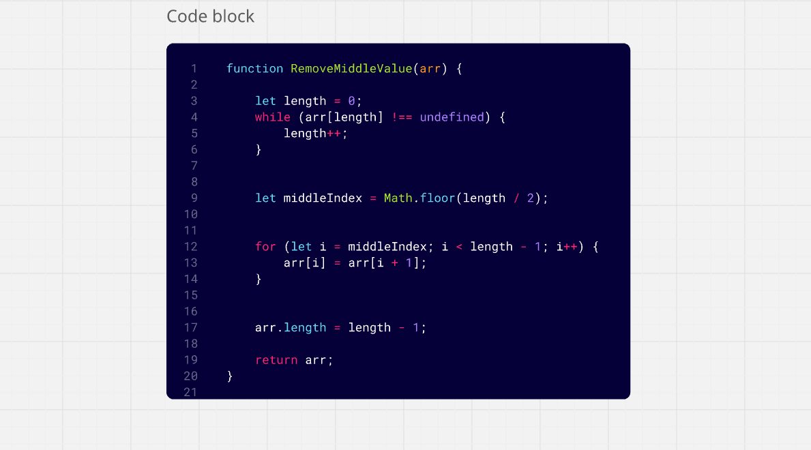

># 👩‍🎓Challenge 04: Remove middle value

## 🖋️ Challenge Description: 

### 1️⃣Find array length manually
### 2️⃣Find middle index
### 3️⃣Shift elements left from middle index
### 4️⃣Shorten array by one element

#
⬇️

##

