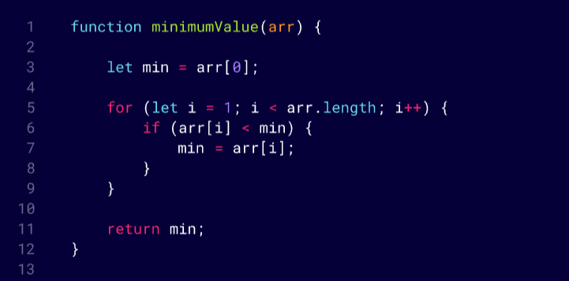

# Challenge 02: Minimum-Value 

## 🖋️ Challenge Description: 

### First I'll Assume the first element is the smallest to start
### Second Loop through the array starting from the second element
### Third Update min if a smaller value is found

##

##

